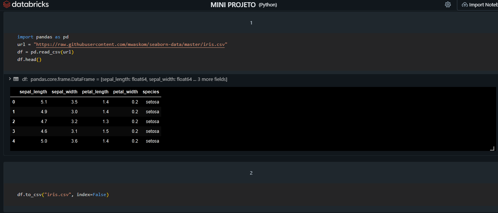
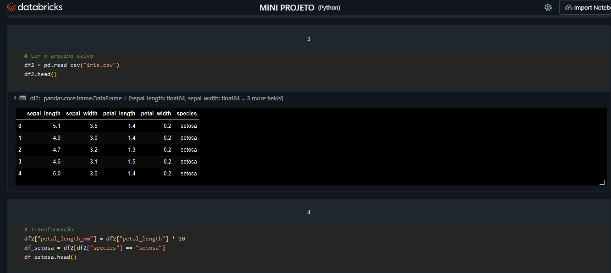
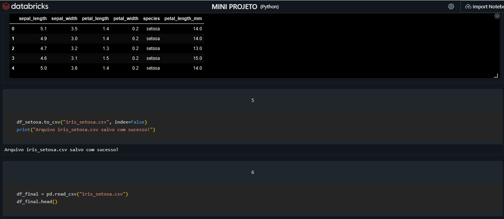
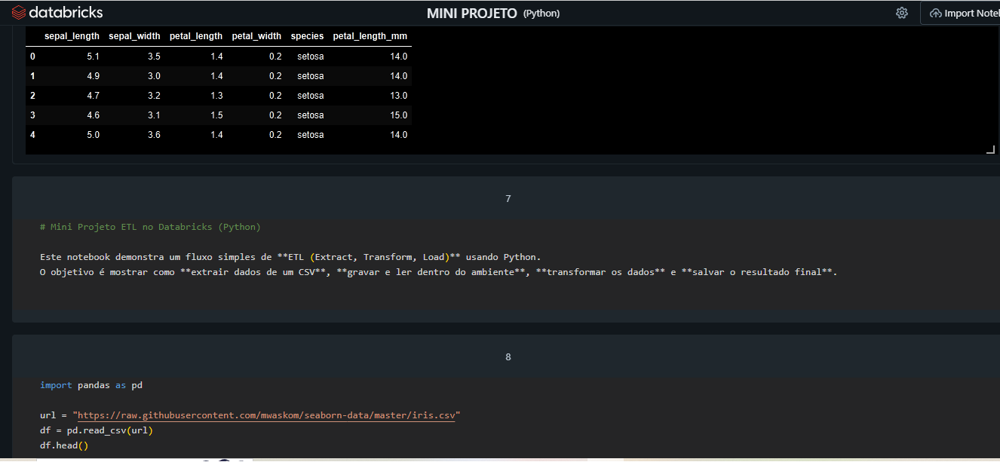

# Mini Projeto ETL no Databricks (Python)

Este repositório contém meu primeiro mini projeto de **ETL** usando Python e pandas dentro do Databricks Community Edition.

## O que eu fiz
- Extraí o dataset Iris de um CSV online
- Salvei o dataset em arquivo local
- Li novamente para validar
- Transformei os dados criando uma nova coluna (`petal_length_mm`) e filtrando apenas a espécie *setosa*
- Salvei o resultado final em um novo arquivo (`iris_setosa.csv`)
- Validei o pipeline lendo o arquivo final

## Fluxo do Projeto

### Passo 1 

### Passo 2 

### Passo 3 

### Passo 4 

## Objetivo
Praticar os conceitos básicos de ETL e mostrar como é possível estruturar um fluxo simples de dados dentro do Databricks.

---

✨ Esse projeto é parte da minha jornada de aprendizado em engenharia de dados.

